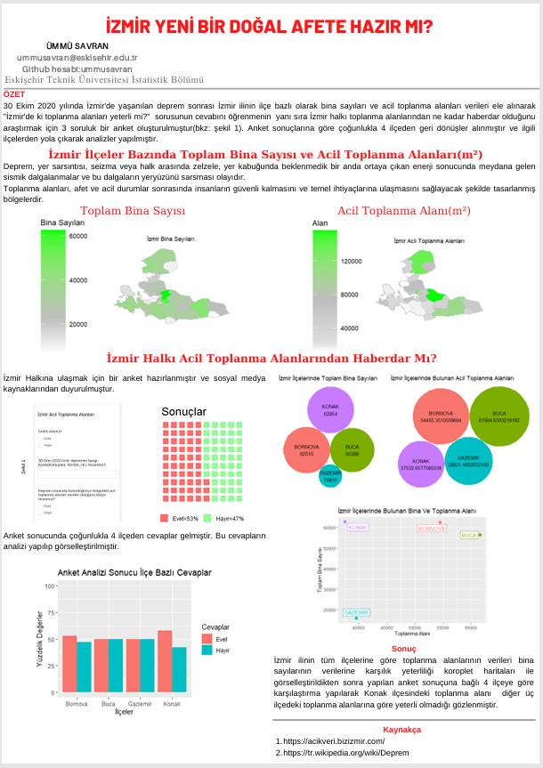

# 📊 İzmir Yeni Bir Doğal Afete Hazır mı?

Bu proje, **Eskişehir Teknik Üniversitesi İstatistik Bölümü** lisans eğitimim sırasında, İzmir ilinin bina yoğunluğu ile acil toplanma alanlarının yeterliliğini analiz etmek amacıyla hazırlanmıştır.

## 🖼 Proje Posteri

## 🔍 Proje Hakkında
30 Ekim 2020 İzmir depremi sonrasında;
* İzmir ilinin ilçe bazlı **bina sayıları** ve **acil toplanma alanları** ($m^2$) verileri ele alınmıştır.
* Halkın bu alanlar hakkındaki farkındalığını ölçmek için bir anket çalışması yapılmıştır.
* **Koroplet haritalar**, **kabarcık grafikleri** ve karşılaştırmalı analizler kullanılarak görselleştirme yapılmıştır.

## 📉 Öne Çıkan Bulgular
Analizler sonucunda **Konak** ilçesindeki toplanma alanlarının, bina yoğunluğuna oranla diğer ilçelere göre **yetersiz** olduğu gözlemlenmiştir.

## 🛠 Kullanılan Teknolojiler
* **Dil:** R / Python
* **Kütüphaneler:** ggplot2, pandas 
* **Veri Kaynağı:** İzmir Açık Veri Portalı
